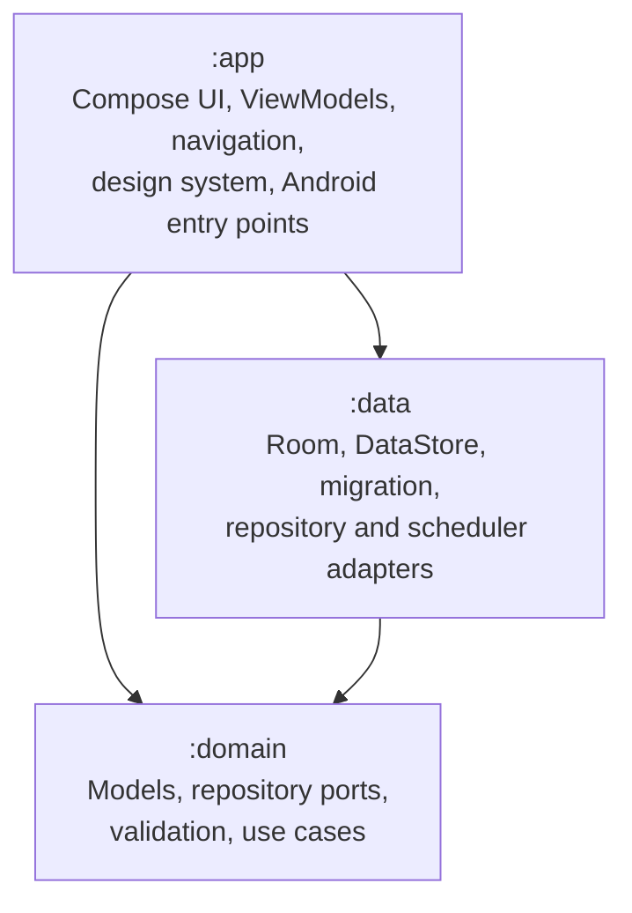
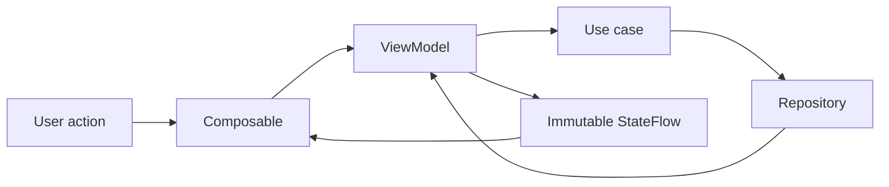

# Wateria Revamp: Phase 0 Architecture Blueprint

Status: approved baseline

Date: 2026-07-17

Scope: architecture and product-preservation decisions only; no implementation

## 1. Outcome

Wateria will be rebuilt as a Kotlin-first, local-first Android application using
Clean Architecture, Jetpack Compose, Material 3, unidirectional data flow, Room,
DataStore, Hilt, and WorkManager.

The architecture deliberately adopts the dependency direction and state patterns
used by Universal Plus Android while avoiding its streaming-specific scale. Wateria
starts with three Gradle modules rather than separate modules for every feature,
data source, UI component group, and analytics provider.

The revamp must update the implementation without losing existing user data,
changing the application identity, or replacing Wateria's playful green/orange
brand with a generic Material appearance.

## 2. Goals

- Preserve every valid legacy plant and preference.
- Preserve the existing application ID and signing/update path.
- Preserve Wateria's recognizable green/orange visual identity.
- Preserve functional parity, including the Google Lens shortcut.
- Replace mutable global state with observable repositories and immutable UI state.
- Make date, watering, migration, and reminder behavior deterministic and testable.
- Provide stable plant and icon identities.
- Support current Android platform behavior, accessibility, privacy, and security.
- Establish automated quality gates before feature migration begins.
- Keep the architecture proportional to Wateria's size.

## 3. Non-goals for the parity release

- A network backend or account system.
- Cloud synchronization.
- A full watering-history product or statistics dashboard.
- Automatic plant identification inside Wateria.
- A large feature-module hierarchy.
- A custom navigation framework.
- Multiple analytics-provider modules.
- A complete visual rebrand.
- New monetization or social features.

These can be evaluated after the parity release is stable.

## 4. Approved product decisions

### 4.1 Feature-parity matrix

| Area | Decision for parity release | Notes |
|---|---|---|
| Plant list | Keep and rebuild | Reactive list, stable identity, correct overdue ordering |
| Add plant | Keep and rebuild | Shared editor implementation with edit flow |
| Edit plant | Keep and rebuild | Address plants by ID, never adapter position |
| Water plant | Keep and correct | Set next date to today plus watering interval |
| Delete plant | Keep | Confirm destructive actions |
| Delete all | Keep | Confirm and cancel irrelevant reminder work |
| Reminders | Keep and replace internals | WorkManager-backed, persisted and rescheduled reliably |
| Remind later | Keep | Configured snooze duration; separate unique work |
| Notification water action | Keep | Stable plant ID instead of Parcelable snapshot |
| Settings | Keep and rebuild | Reactive DataStore-backed settings |
| Onboarding | Keep and redesign internally | Completion recorded only when onboarding completes |
| Tips | Keep | Review scientific/editorial claims and fix rotation logic |
| Google Lens | Keep with the same user experience | Fix package visibility and failure handling; no result import |
| Rate app | Keep | Robust Play Store/browser fallback |
| About/licenses | Keep | Verify dependency and asset attribution |
| Analytics | Reduce | No plant names or user-entered content |
| Crash reporting | Keep | Privacy policy and configuration must match behavior |
| Watering history | Defer | No legacy history exists; avoid expanding parity scope |

### 4.2 Behavior contract

- New plant names are trimmed, must not be blank, and are limited to 50 characters.
- Duplicate names are allowed because plant identity is a stable UUID.
- Legacy names are migrated verbatim; normalization occurs only after a user edits them.
- Watering frequency remains 1 through 40 days for parity.
- Watering today schedules the next watering for `today + frequency`.
- Upcoming, due-today, and overdue states remain distinct.
- Overdue plants display the number of overdue days rather than collapsing to zero.
- Plants sort by next watering date, then display name, then stable ID.
- Destructive operations require confirmation.
- Reminder delivery is best-effort around the selected time, not an exact-alarm guarantee.
- The default reminder is enabled at 18:00 with a one-hour snooze, matching legacy defaults.
- Snooze choices may be presented as a small set of useful presets while preserving
  migrated legacy values between 1 and 23 hours.
- Google Lens remains externally launched and does not populate a plant automatically.

## 5. Architecture decisions

### ADR-001: Three Gradle modules

Use `:app`, `:domain`, and `:data`.

Rationale: this enforces the most important Clean Architecture boundaries without
the maintenance cost of a module per screen or data-source type. Feature modules
can be extracted later when build performance or team ownership justifies them.

### ADR-002: Pure Kotlin domain

`:domain` contains no Android, Compose, Room, DataStore, Firebase, or Hilt APIs.
It owns business models, repository contracts, validation, date rules, and use cases.

### ADR-003: Compose presentation

Use a single activity, Jetpack Compose, Material 3, typed Navigation Compose routes,
ViewModels, coroutines, and immutable `StateFlow` screen state.

### ADR-004: Room plus Preferences DataStore

Room stores structured plant records. Preferences DataStore stores reminder,
onboarding, tip, migration, and other scalar settings. Derived values such as
days remaining are never persisted.

### ADR-005: Hilt dependency injection

Use a small Hilt graph for repositories, ViewModels, clock/time dependencies,
analytics, and WorkManager workers. Hilt is justified because the same repository
graph is required by UI and background work.

### ADR-006: Java time with an injected clock

Use `java.time.LocalDate`, `LocalTime`, `Instant`, and `Clock`, with core-library
desugaring for the retained minimum SDK. Remove ThreeTenABP after migration.

### ADR-007: WorkManager reminders

Schedule unique one-time work for the next reminder occurrence. After execution,
query current persisted data, send any required notification, and schedule the next
occurrence. Use separate unique work for snoozing.

### ADR-008: Semantic icon identities

Persist stable string keys such as `cactus_01`, never Android resource integers.
UI resources map from the semantic key at the presentation boundary.

### ADR-009: Privacy-safe telemetry

Analytics is accessed through a small abstraction. Events contain controlled enums
and booleans only; plant names and other user-entered content are prohibited.

## 6. Module and dependency map



Rules:

- `:domain` depends on Kotlin/JDK APIs only.
- `:data` depends on `:domain` and Android persistence/background APIs.
- `:app` depends on `:domain` and includes `:data` as the composition implementation.
- Feature ViewModels import domain use cases, not DAOs, DataStore, or data implementations.
- Feature packages do not call one another directly.
- Navigation is owned by the app shell; screens receive typed callbacks.
- Android resource IDs do not cross into domain or persistence models.
- Firebase types do not cross into domain, repositories, or feature state.

## 7. Proposed package layout

```text
domain/src/main/kotlin/com/wateria/domain/
  model/
  repository/
  usecase/
  validation/
  time/

data/src/main/kotlin/com/wateria/data/
  database/
    dao/
    entity/
    mapper/
  preferences/
  migration/
  repository/
  reminders/
  di/

app/src/main/kotlin/com/wateria/
  WateriaApplication.kt
  MainActivity.kt
  navigation/
  design/
    color/
    typography/
    component/
    icon/
  feature/
    plants/
    editor/
    settings/
    tips/
    onboarding/
    about/
  lens/
  notifications/
  analytics/
  di/
```

Test fixtures stay in the module that owns the contract. A separate `:core:test`
module is not justified initially.

## 8. Domain model

### Plant

```text
Plant
  id: PlantId (UUID)
  name: String
  icon: PlantIcon (stable semantic key)
  wateringIntervalDays: Int
  nextWateringDate: LocalDate
```

### Derived watering state

```text
WateringStatus
  Upcoming(daysRemaining)
  DueToday
  Overdue(daysOverdue)
```

The status is calculated from `nextWateringDate` and an injected clock. It is not
stored in Room and therefore cannot become stale across midnight.

### Reminder settings

```text
ReminderSettings
  isEnabled: Boolean
  time: LocalTime
  snoozeDuration: Duration
```

### Supporting values

- `PlantId`: validated UUID value.
- `PlantIcon`: stable set of 44 parity icon keys plus an explicit fallback.
- `PlantName`: validation result or value object, depending on implementation weight.
- `WateringInterval`: validated 1 through 40 day value.

## 9. Domain contracts and use cases

### Repository ports

`PlantRepository`:

- `observePlants(): Flow<List<Plant>>`
- `getPlant(id: PlantId): Plant?`
- `insert(plant: Plant)`
- `update(plant: Plant)`
- `delete(id: PlantId)`
- `deleteAll()`

`SettingsRepository`:

- `observeReminderSettings(): Flow<ReminderSettings>`
- `updateReminderSettings(settings: ReminderSettings)`
- onboarding and tip-progress reads/writes through focused methods

`ReminderScheduler`:

- `scheduleNextReminder()`
- `cancelDailyReminder()`
- `scheduleSnooze(duration)`
- `cancelSnooze()`

### Use cases

- `ObservePlantsUseCase`
- `GetPlantUseCase`
- `CreatePlantUseCase`
- `UpdatePlantUseCase`
- `WaterPlantUseCase`
- `DeletePlantUseCase`
- `DeleteAllPlantsUseCase`
- `GetDuePlantsUseCase`
- `ObserveReminderSettingsUseCase`
- `UpdateReminderSettingsUseCase`
- `CompleteOnboardingUseCase`
- `ObserveTipProgressUseCase`
- `UpdateTipProgressUseCase`

Use cases are added for business actions and orchestration, not as one-line wrappers
for every DAO method. ViewModels depend on these use cases and expose screen-specific
state rather than domain entities mixed with UI flags.

## 10. Persistence schema

### Room database

Database file: `wateria.db`

Initial schema version: 1

Room schema export: enabled and committed

`plants` table:

| Column | Type | Rules |
|---|---|---|
| `id` | TEXT | UUID primary key |
| `name` | TEXT | Non-null; legacy value may predate new validation |
| `icon_key` | TEXT | Non-null stable semantic key |
| `watering_interval_days` | INTEGER | Non-null; 1 through 40 |
| `next_watering_epoch_day` | INTEGER | Non-null local calendar date |
| `created_at_epoch_millis` | INTEGER | Non-null; deterministic migration timestamp |
| `updated_at_epoch_millis` | INTEGER | Non-null |

No `days_remaining`, drawable ID, list position, or notification state is stored.

### Preferences DataStore

| Key | Type | Default |
|---|---|---|
| `reminders_enabled` | Boolean | `true` |
| `reminder_hour` | Int | `18` |
| `reminder_minute` | Int | `0` |
| `snooze_duration_minutes` | Int | `60` |
| `onboarding_version_completed` | Int | `0` |
| `next_tip_index` | Int | `0` |
| `last_tip_epoch_day` | Long? | absent |
| `legacy_migration_state` | String enum | `not_started` |
| `legacy_migration_version` | Int | `0` |

Notification permission is read from the operating system and is not duplicated as
a preference.

## 11. Legacy migration

The normative v1.6 persistence and icon mapping contract is defined in
[`legacy-v1-migration-contract.md`](legacy-v1-migration-contract.md).

Migration requirements:

- Run before the repository exposes user data to the first Compose screen.
- Use an idempotent state machine: `not_started`, `in_progress`, `complete`, `failed`.
- Keep legacy preferences untouched through at least one stable production release.
- Parse plant entries independently so one malformed item cannot erase the array.
- Never log plant names or raw JSON.
- Use deterministic IDs for retry safety.
- Map every known v1.6 resource integer to a stable semantic icon key.
- Use a defined fallback for unknown icons and retain the plant.
- Record counts of migrated, repaired, and failed records without recording content.
- Do not mark migration complete until both Room and DataStore results are verified.
- On unrecoverable whole-payload failure, preserve the payload and show a recovery
  state rather than presenting an empty list that can overwrite legacy data.

## 12. UI state and event model

Every screen follows this flow:



Rules:

- UI state is immutable.
- `MutableStateFlow` is private to the ViewModel.
- Compose collects state with lifecycle awareness.
- User actions are explicit functions or sealed actions.
- State changes do not trigger circular UI-to-ViewModel effects.
- Editor state survives configuration and process recreation where practical.
- One-off navigation follows successful actions through a deliberate effect mechanism.
- List item actions always carry `PlantId`, never position.

## 13. Navigation and screen map

Use a single `MainActivity` with typed routes:

```text
App start
  -> migration/bootstrap state
  -> onboarding when required
  -> home/plants

Home
  -> add plant
  -> edit plant/{plantId}
  -> settings
  -> middle action sheet
       -> Google Lens
       -> rate app
       -> tip of the day

Settings
  -> licenses
  -> about
```

The custom bottom navigation hierarchy remains familiar. `NavController` stays in
the app navigation package; feature screens receive callbacks or typed destinations.

## 14. Reminder and notification design

### Daily reminder

1. A settings change invokes `scheduleNextReminder` or cancellation.
2. The scheduler calculates the next selected local time.
3. WorkManager enqueues uniquely named one-time work.
4. At execution, the worker queries Room through `GetDuePlantsUseCase`.
5. It recalculates status using the current date.
6. It posts no notification when reminders are disabled or no plants are due.
7. It posts the parity notification when plants are due.
8. It schedules the following occurrence in a `finally`-safe path when enabled.

### Notification parity

- One due plant: show the plant and provide Water plus Remind Later actions.
- Multiple due plants: show the count and provide Remind Later, matching current behavior.
- Notification tap opens the home list.
- Water action contains only a stable plant UUID and validates it before mutation.
- Remind Later schedules separate unique snooze work for the configured duration.
- Disabling reminders or deleting all plants cancels relevant work and notifications.
- All receivers/services/workers are internal and non-exported unless Android requires otherwise.

### Permission behavior

- Explain the benefit before requesting notification permission.
- Request only after the user enables reminders or completes a relevant setup flow.
- Reflect denied and permanently denied states in Settings.
- Never imply reminders are active when the operating system blocks them.

## 15. Google Lens boundary

Google Lens remains part of feature parity.

Define an app-layer `PlantIdentificationLauncher` abstraction with outcomes:

- `Launched`
- `Unavailable`
- `Failed`

The Android implementation:

- Declares required package visibility.
- Checks for the Lens package safely.
- Launches the existing external experience.
- Offers the existing store fallback when unavailable.
- Handles missing Play Store and activity-launch failures.
- Does not pass user plant data or expect an identification result.

The UI placement and interaction remain familiar. Deeper identification is a separate
post-revamp product investigation.

## 16. Design-system direction

Wateria's playful green/orange identity is a preservation requirement.

Preserve:

- Green and orange as primary brand signals.
- Plant illustrations and icon personality where licensing permits.
- Rounded, friendly shapes.
- Warm, encouraging copy.
- Recognizable custom bottom-navigation behavior.

Modernize:

- Create semantic color tokens rather than using raw colors in screens.
- Adjust exact shades where required for accessible contrast.
- Support light and dark color schemes.
- Define typography, spacing, elevation, radius, and motion tokens.
- Use responsive width constraints and adaptive layouts.
- Support large fonts, landscape, tablets, RTL, and edge-to-edge rendering.
- Give actionable elements specific semantics and hide decorative imagery from accessibility.

Initial reusable components:

- `WateriaTheme`
- `WateriaTopBar`
- `WateriaBottomBar`
- `PlantCard`
- `PlantIcon`
- `WaterButton`
- `WateriaButton`
- `SettingsRow`
- `EmptyPlantsState`
- `ConfirmationDialog`
- `NumberOrIntervalPicker`

Existing assets require a provenance/license audit before direct reuse.

## 17. Analytics, privacy, backup, and security

### Allowed analytics

Examples:

- `plant_created`
- `plant_updated`
- `plant_watered` with controlled source enum (`app`, `notification`)
- `plant_deleted`
- `reminders_enabled`
- `reminder_snoozed`
- `tip_feedback` with controlled tip index and sentiment
- `lens_opened` with controlled result enum

Prohibited fields:

- Plant name.
- Raw icon/resource values.
- Free-form text.
- Raw migration payloads.
- Exact user-entered dates when not operationally necessary.

### Platform protection

- Internal Android components are `exported=false`.
- Pending intents are immutable and use unique identities where required.
- Intent extras are validated before use.
- Explicit backup/data-extraction rules document whether plant and preference data are backed up.
- Firebase collection behavior matches the linked privacy policy and Play Data Safety declaration.
- Debug and production Firebase ownership, access, and API restrictions are audited.
- No secrets, keystores, tokens, or private endpoints are committed.

## 18. Build and quality baseline

- Preserve `applicationId` and signing/update identity.
- Preserve `minSdk 21` unless production device data justifies changing it.
- Target the Play-required/current Android API at implementation time.
- Use Kotlin DSL and a Gradle version catalog.
- Use current mutually compatible stable versions selected at implementation time.
- Use KSP where supported by Room and Hilt.
- Use Java toolchains and core-library desugaring.
- Remove JCenter and obsolete support dependencies.
- Enforce formatting with Spotless or ktlint.
- Enforce static analysis with Detekt and Android lint.
- Export and commit Room schemas.
- Add dependency-update automation.

Minimum CI gates:

1. Debug compilation.
2. Unit tests.
3. Android lint.
4. Detekt.
5. Formatting check.
6. Release compilation without publishing or external upload side effects.

## 19. Testing strategy

### Domain unit tests

- Create/update validation.
- Duplicate names.
- Watering date calculation.
- Upcoming/due/overdue boundaries.
- Sorting and deterministic tie-breaking.
- Leap year and timezone/date-boundary cases.

### Migration tests

- Empty and missing legacy preferences.
- All 44 legacy icons.
- Multiple valid plants.
- Duplicate and whitespace names.
- Malformed whole JSON.
- Malformed individual entries.
- Invalid dates and frequency values.
- Unknown icon IDs.
- Interrupted and retried migration.
- Existing Room data plus incomplete migration marker.
- Preservation of reminder, onboarding, and tip settings.

### Data tests

- DAO insert/update/delete/query ordering.
- Repository mapping.
- Room schema migration tests for every future version.
- DataStore default and update behavior.

### Presentation tests

- ViewModel state transitions and errors.
- Add/edit validation.
- Water and delete actions.
- Settings and permission state.
- Tip rotation.
- Lens available/unavailable/failure behavior.

### Device tests

- Upgrade from a legacy preference fixture.
- Add/edit/water/delete user journey.
- Notification permission and actions.
- Reminder rescheduling after process death/reboot conditions supported by test tooling.
- Large font, dark theme, Spanish, and TalkBack smoke coverage.

## 20. Definition of Done

A revamp task is complete only when:

- It respects module dependency rules.
- Domain logic is independent from Android APIs.
- UI state is immutable and lifecycle-aware.
- User-visible strings are localized in English and Spanish.
- Accessibility semantics are intentional.
- Relevant unit tests are added and passing.
- Relevant user-facing flows are exercised on an emulator/device.
- Lint, Detekt, formatting, and compilation gates pass.
- Analytics contains no user-generated content.
- Data and migration compatibility are reviewed for persistence changes.
- Documentation is updated when behavior or architecture changes.

The parity release is complete when:

- All feature-parity decisions in this document are implemented or explicitly re-approved.
- Valid v1.6 data upgrades without loss.
- Invalid legacy data cannot be silently overwritten.
- Reminder behavior survives normal process and device lifecycle events.
- Security, backup, privacy, and accessibility reviews pass.
- Internal testing and staged rollout checks pass.

## 21. Ordered implementation roadmap

### Phase 1: Migration safety net

1. Capture representative legacy preference fixtures.
2. Encode the 44-entry icon mapping as a tested contract.
3. Write characterization tests for v1.6 parsing and watering behavior.
4. Define migration recovery and rollback fixtures.

Exit: legacy compatibility is executable and failing safely before resources change.

### Phase 2: Modern foundation

1. Introduce Kotlin DSL, version catalog, and quality tools.
2. Create `:domain` and `:data` modules.
3. Configure Kotlin, Compose, Hilt, Room, DataStore, WorkManager, and Java time.
4. Add the app shell, theme foundation, and typed navigation.
5. Add CI gates.

Exit: the modern skeleton builds and the legacy safety tests pass.

### Phase 3: Domain and data

1. Implement domain models, repository contracts, and business use cases.
2. Implement Room and DataStore adapters.
3. Implement the idempotent legacy migration.
4. Implement reminder scheduling ports and adapters.

Exit: repositories expose correctly migrated, reactive data under tests.

### Phase 4: Plant vertical slice

1. Build the plant list and empty state.
2. Build the shared add/edit editor.
3. Implement watering, deletion, sorting, and overdue presentation.
4. Validate the end-to-end flow on an emulator.

Exit: Wateria's core loop works entirely through the new architecture.

### Phase 5: Supporting parity features

1. Reminders, notifications, snooze, and permission states.
2. Settings.
3. Onboarding and tips.
4. Middle action sheet, Google Lens, rating, about, and licenses.

Exit: feature parity is complete.

### Phase 6: Hardening

1. Accessibility and responsive layouts.
2. Dark theme and localization review.
3. Privacy-safe analytics and Crashlytics configuration.
4. Backup, security, and package-visibility rules.
5. Asset attribution and repository cleanup.

Exit: all quality and policy reviews pass.

### Phase 7: Release validation

1. Upgrade tests using legacy fixtures and real-device samples where available.
2. Device/emulator matrix and notification lifecycle tests.
3. Internal testing release.
4. Staged production rollout with migration/crash monitoring.

Exit: stable production rollout completes without migration-related data loss.

## 22. Approval gate

This document is the approved Phase 0 baseline. Any later change to a preserved feature,
legacy-data behavior, application identity, module boundary, or reminder guarantee
requires an explicit decision rather than an incidental implementation change.

Phase 1 may begin only after this blueprint and the linked migration contract are
reviewed. Phase 1 changes tests and compatibility scaffolding first; it does not
start with UI conversion.
